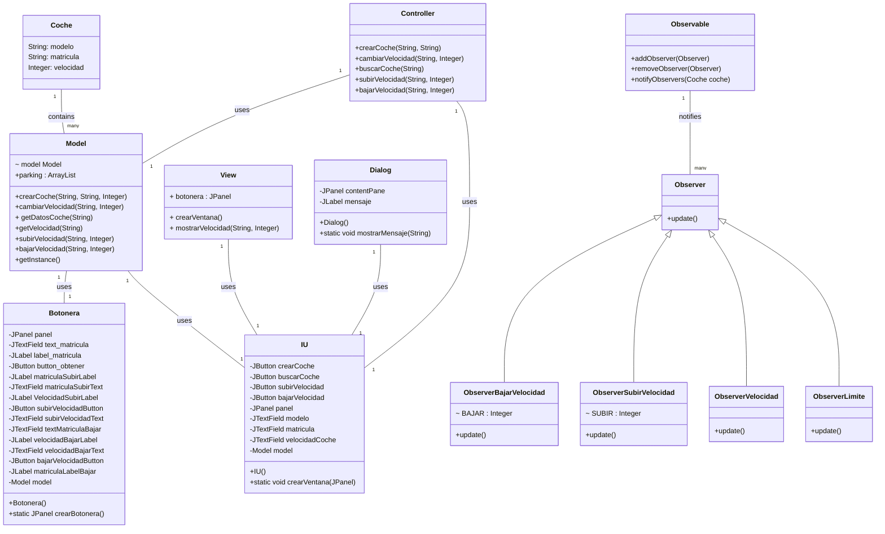
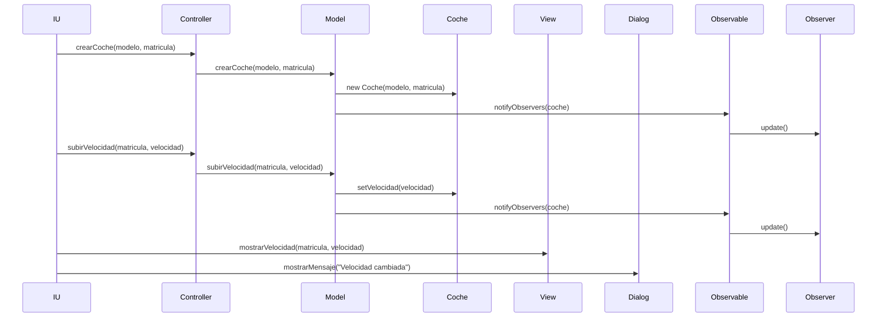

# Tarea: arquitectura MVC

Tarea para implementar arquitectura MVC

### Diagrama de clases:
Diagrama de clases de la aplicación

---

### Diagrama de Secuencia

Diagrama de secuencia de la creación de un coche, subir la velocidad y mostrar la velocidad en la vista.

